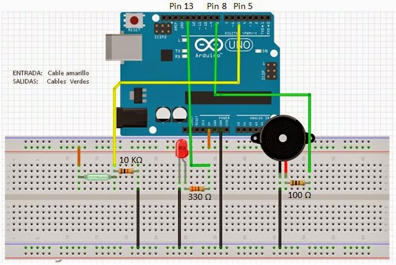

## Alarma con RedSwitch y sensor de movimiento PIR

***objetivo***

Implementar una alarma unsado un Zumbador. La alamrma se activara mendiante la instalación de un interruptor magnetico (Red Switch) que al pasar un iman cerca de el, activara la alarma y al mismo tiempo se encedera un led. La alarma tambien cuenta con un sensor de movimiento PIR, que al acercarse un objeto cerca de el, envia una señal al ardino para encender la larma. 

***Interruptor Magnetico (Red Switch)***
--------------------------------------------
Una magnetic reed es un dispositivo electromecánico que se comporta como un interruptor que se activa ante la presencia de un imán.
Los sensores magnetic reed son ampliamente utilizados. Por ejemplo, muchas alarmas de puertas y ventanas funcionan ubicando un imán en el elemento, y detectando la apertura con un magnetic reed. También podemos ubicar el imán en una puerta, o vitrina, para encender una luz, etc.
Como un magnetic reed no deja de ser un interruptor, podemos emplear este dispositivo para encender o apagar un dispositivo directamente. Por supuesto, también podemos emplear las entradas digitales de Arduino para leer el estado del magnetic reed, de forma similar a como vimos en la entrada leer un pulsador con Arduino.

***Materiales***
----------------
- Arduino Uno
- Red Switch
- 2 LED´s
- Sensor de movimiento PIR
- Iman 
- Cable de cobre

# Diagrama de configuración :
---------------------------------------------
 

<pre>

int led = 13; //variable of the LED initialized in 13
int reedswitch = 5; //variable of the REED SWITCH initialized in 5
int buzzer = 8; //variable of the BUZZER initialized in 8
int val = 0; 

// the method setup Configures the specified pin to behave either as an input or an output
void setup(){
  pinMode(led, OUTPUT); //configure the LED pin to behave like an output 
  pinMode(reedswitch, INPUT); //configure the REED SWITCH pin to behave like an input
  pinMode(buzzer, OUTPUT); //configure the BUZZER pin to behave like an output 
}

/* the loop method is responsible for validating if the value of the REED SWHITCH is in the LOW state, 
if it is true it changes the pins of the LED and from the BUZZER to HIGH,
in case the REED SWITCH pin is in the HIGH state, change the LED and BUZZER pins to LOW
*/

void loop(){
  val = digitalRead(reedswitch); //the variable "val" take the value of the pin of the REED SWITHC
  if(vall == LOW){ //the clausule IF, check if the value of the variable "val" is equal to LOW
    digitalWrite(led, HIGH); // then the pin of the LED take the value HIGH
    digitalWrite(buzzer, HIGH); // then the pin of the BUZZER take the value HIGH
    delay(200;  
  } else {
      digitalWrite(led, LOW);  // if the clasule "IF" is not met, the pin of the LED and the BUZZER take the value LOW 
      digitalWrite(buzzer, LOW);
  }
}
</pre>

En la actualidad software libre es consecuencia del método de la ética ya que por elección manifiesta de su autor puede ser copiado, estudiado, modificado, utilizado libremente con cualquier fin y redistribuido con o sin cambios o mejoras. En esta practica se utilizaron los siguientes:
- Debian (Sistema Operativo)
- NotePad ++

# Pruebas:
---------------------------------------------
 

Proyecto realizado por:
-----------------------
Saucedo Guerrero Daniel de Jesús
14240859@itleon.edu.mx
Instituto Tecnológico de León
